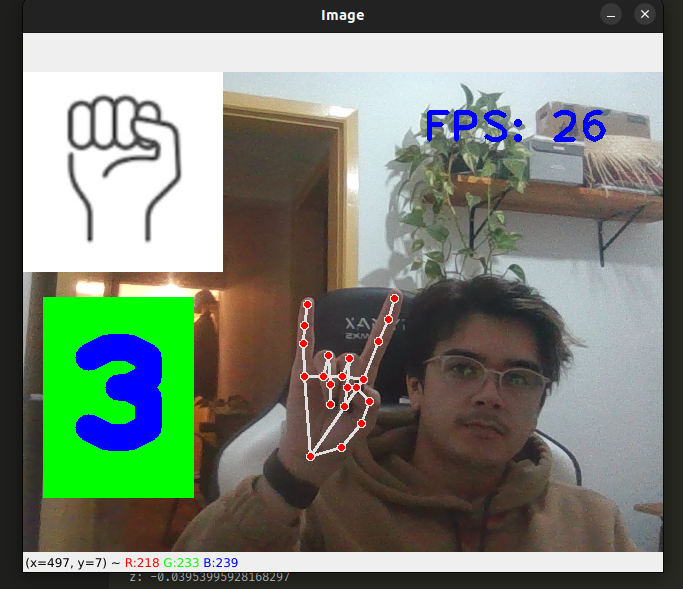

# finger-counter-py

I am studying on how to perform "object position detection" so that I can do another project.At Momentom, my goal is to be able to detect people walking through any image or video input (MP4, streaming, etc.).

## Demo




## Getting started

```bash
# download repository
git clone https://github.com/andersonbosa/finger-counter-py.git

# change directory
cd finger-counter-py

# create virtual environment
python -m venv .venv
source .venv/bin/activate

# install dependencies
pip install -r requeriments.txt

# run project
python main.py
```